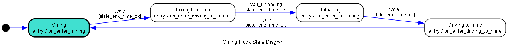

# vast_code_challenge

You are tasked with developing a simulation for a lunar Helium-3 space mining operation. This
simulation will manage and track the efficiency of mining trucks and unload stations over a
continuous 72-hour operation

### Design thoughts

* The "Mining Sites" locations do not need to be represented by an object/class. There are an unlimited number (sites never block) and
the amount of time at each site is random.
* Trucks have four states: driving to the mine, mining, driving to unload, and unloading.
  * "Full" (between mining and driving to unload) could be a state, but "full" is really just the end of the mining state.
  * Same goes for "empty".
  * Waiting to unload (queued) can be combined into a longer Unloading state.
* There is a queueing mechanism that must be accounted for - assigning each truck to an unload station, even if waiting.
* Unloading stations themselves are pretty simple, but the queue might demand an object.

For this simulation, I will simulate each minute instead of each second to improve processing time (by 60x!). Given that each truck
is mining for 1-5 hours, the detail of each second of the simulation is not necessary. Micromanaging a truck
down to the second is unrealistic.

I will use the [python-statemachine](https://pypi.org/project/python-statemachine/) library to implement the trucks'
five states. I find this library easy to use, well-documented, and it is easy to read statemachine-based classes
after-the-fact with the help of the auto-generated state diagram.

I will use pytest to run the actual simulation, in addition to testing the code, to show an example of using
it as a runner. Parametrization will be useful.

The underlying goal is:
>  Calculate and report statistics for the performance and efficiency of each mining truck and unload station.

Since driving and mining are both unblocked operations, "performance and efficiency" must refer to the queue.
Thus, the trucks will have to track how long they are waiting, and the unload stations will have to track how often
they have trucks queueing.

### Testing & Linting

Test/Lint are performed by Github Actions every PR.

In a resource-unlimited world, I'd pin package versions using pip-compile or uv.

